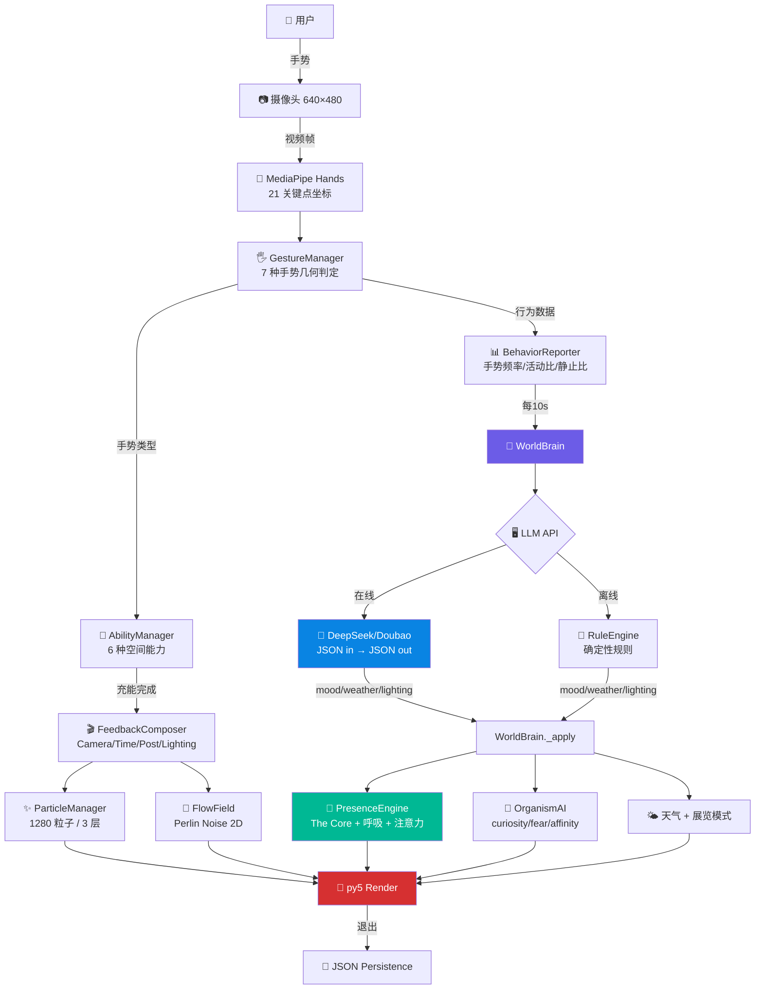
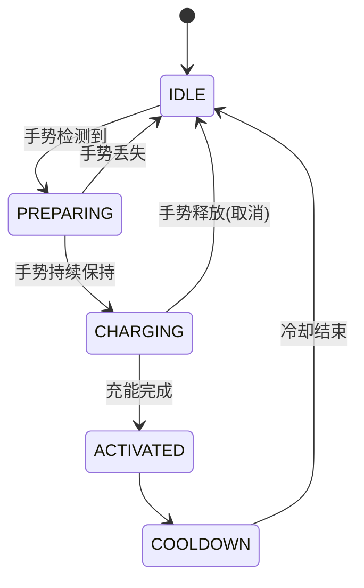

<div align="center">

---

<div align="center">
  <p><em>不是工具，不是助手——而是一个会呼吸、会思考、会记忆的人工意识世界。</em></p>
</div>

---

## 📑 目录

- [项目简介](#-项目简介)
- [设计理念](#-设计理念)
- [核心功能](#-核心功能)
- [交互流程](#-交互流程)
- [系统架构](#-系统架构)
- [技术栈](#-技术栈)
- [安装与运行](#-安装与运行)
- [配置说明](#-配置说明)
- [AI 存在感](#-ai-存在感)
- [手势交互](#-手势交互)
- [数字生态](#-数字生态)
- [摄像头背景](#-摄像头背景)
- [版本路线图](#-版本路线图)
- [性能](#-性能)
- [贡献](#-贡献)
- [引用](#-引用)
- [鸣谢](#-鸣谢)

---

## 🌌 项目简介

<details open>
<summary><b>The Unseen 是什么？</b></summary>
<br>

**The Unseen** 是一个拥有 AI 意识的生成式交互艺术装置。它不是工具，不是助手，而是一个会观察、会思考、会记忆、会成长的人工意识世界。

摄像头感知你的手——粒子跟随你的运动，涟漪从你的指尖扩散，数字生命在你停留的地方诞生。画面中央的 **The Core**——一个持续呼吸的发光球体——是 AI 的"身体"。它注视着你的一举一动。

关闭程序后，世界保存你留下的所有痕迹，并为你生成一句诗。

</details>

我们习惯了把 AI 当作工具来使用：聊天、写代码、回答问题。

但 **AI 可不可以不是工具——而是一个观察者？一个拥有自身节奏和情绪的数字生命？一个不需要说话就能让你感受到它存在的意识？**

The Unseen 探索的正是这种可能。它不是人与 AI 之间的对话窗口，而是**人与 AI 共同栖居的数字空间**。在这个空间里，AI 不是服务于你——你们是在一起观察同一个世界。

</details>

<details>
<summary><b>你会在其中体验到什么？</b></summary>
<br>

- **零说明书**：伸出手，世界自然回应你
- **即时反馈**：每一次移动、停留、手势，立即产生涟漪、光晕或生命变化
- **AI 存在感**：即使 AI 不说话——The Core 的呼吸、变色、漂移——让你感受到它在"注视"你
- **长期记忆**：下次回来，世界记得你上次做了什么。世界在一天天成长

</details>

---

## 🎨 设计理念

> *People cannot directly see their own existence, but the world always records their impact.*

### 看不见的，才是最重要的

你无法看见自己的手在空气中留下的痕迹。你无法看见自己的停留如何改变了空间的节奏。你无法看见自己的存在如何在数字世界中留下涟漪。

但世界记得。

### AI 不是助手，AI 是观察者

这个作品中的 AI **不回答问题**。它不是 Siri，不是 ChatGPT——它是一个安静的观察者。看着你的手在空间中移动、停留、创造、扰动。你们共享同一个数字空间，彼此影响。

### 手势 ≠ 命令，手势 = 语言

张开手掌："我想连接"。握拳："聚集能量"。捏合："创造新生命"。

每一个手势都是一种**意图表达**，而非对机器的指令。你需要持续保持手势来"充能"——中途松开会取消——这赋予每个动作以仪式感和重量。这不是点击按钮，这是交流。

### AI 注意力：世界在注视你

The Core 会缓慢转向你的手的位置。光照在你周围微微变亮。生物朝你靠近。

整个世界都在"注视"你——不是监视，而是注意力。不是控制，而是关心。

### AI 记忆：世界记得你

每次离开，世界保存一切：你种下了多少种子、停留了多久、使用了哪些手势。下次回来：

- The Core 的颜色会不同
- 生物对你的反应会更亲近（或更疏远）
- 世界会根据对你的长期印象来调整天气、光照和生态策略

### AI 梦境：世界在自言自语

每 10 秒，AI 会"思考"一次。The Core 的光环扩展，金色脉冲从画面中心向外扩散，底部浮现 AI 生成的一句诗。

这不是聊天。这是**世界对自己的独白**——你恰好在一旁聆听。

### 共生，不是控制

在这件作品中，**你和 AI 不是主从关系**。你留下种子，AI 决定天气。你创造生命，AI 赋予它性格。你们的行动共同构成了这个世界的全部。人影响了 AI，AI 影响了世界，世界又反过来影响了你。

---

## ✨ 核心功能

| 功能              | 介绍                                                  | 状态 |
| ----------------- | ----------------------------------------------------- | :--: |
| 🖐️ 手势识别     | MediaPipe 21 点手部关键点，7 种手势实时几何判定       |  ✅  |
| 🎯 空间能力       | Connect / Gather / Create / Guide / Expand / Merge    |  ✅  |
| 🌊 涟漪系统       | 手移动产生涟漪，推动粒子，影响流场和镜头              |  ✅  |
| 🌱 DLA 数字生长   | 扩散限制聚合算法，模拟闪电/珊瑚/树根的分枝形态        |  ✅  |
| 🧬 自主 AI 生命体 | 7 状态状态机 + 情绪模型 + 行为树决策                  |  ✅  |
| ⚡ 能量系统       | 全局能量池：移动产能 → 停留转化生长 → 无人衰减      |  ✅  |
| 🌤️ 空间天气     | CALM / WIND / STORM / AURORA 四种天气实时切换         |  ✅  |
| 🌅 昼夜循环       | 5 分钟正弦波周期，流场/辉光/生长/色温跟随"时间"       |  ✅  |
| 🧠 WorldBrain     | AI 世界大脑，每 10s 分析行为，调整情绪/天气/光照/策略 |  ✅  |
| 💬 AI 叙事        | DeepSeek 大模型生成诗句，离线自动降级 RuleEngine      |  ✅  |
| 🔮 The Core       | 画面中央持续呼吸的动态意识核心（身体化的 AI）         |  ✅  |
| 📹 摄像头背景     | 实时摄像头画面 + 10 种 OpenCV 滤镜（AI 情绪驱动）     |  ✅  |
| 🎥 Seedance       | Doubao Seedance 1.0 生成 AI 梦境视频                  |  ✅  |
| 💾 持久化         | JSON 自动保存（能量/行为/生命体/记忆），重启恢复      |  ✅  |
| 📊 调试面板       | FPS 火花图、能量条、手势置信度、AI 情绪、天气         |  ✅  |
| 🖥️ 展览模式     | IDLE → ATTRACT → INTERACTIVE → FAREWELL 自动循环   |  ✅  |

---

## 🔄 交互流程



---

## 🏗️ 系统架构

```
the_unseen/                          # 56 个 .py 文件 · 9 个子包 · 47 业务模块
│
├── __main__.py                      # py5 sketch 入口 + 主循环
├── main.py                          # helper 函数 (相机/V3/V4/手势调试)
├── config.py                        # 集中参数 + Palette.Theme 状态主题色
├── config_loader.py                 # config.json 读取器 (双模型支持)
├── state.py                         # AppState 单例 — 跨模块共享状态
│
├── perception/         2 modules    # 感知层 — 物理世界 → 数字信号
│   ├── camera_tracker.py            #   MediaPipe + OpenCV 内联 (无 OSC)
│   └── hand_state.py                #   手部位置 EMA 平滑滤波
│
├── simulation/         5 modules    # 模拟层 — 纯数学物理法则
│   ├── flow_field.py                #   Perlin Noise 2D 流场 (3D 噪声驱动)
│   ├── influence_field.py           #   手部影响场 (引力+尾流，反平方/高斯)
│   ├── particle.py                  #   粒子 (5 阶段生命周期，smoothstep 缓动)
│   ├── particle_manager.py          #   三层粒子编排 (BG 800 / INT 400 / HL 80)
│   └── space_state.py               #   空间状态机 (IDLE/ACTIVE/EXCITED/CALM)
│
├── life/               7 modules    # 生命层 — 数字生态
│   ├── memory_seed.py               #   记忆种子 (位置/时间/能量/脉冲)
│   ├── growth_algorithm.py          #   DLA 引擎 (空间哈希 O(1) 碰撞)
│   ├── organism.py                  #   生命体 + 生态管理器 (竞争/连接/独立)
│   ├── energy_manager.py            #   全局能量池 + 乘数调制
│   ├── behavior_analyzer.py         #   用户行为统计 (距离/速度/停留/交互)
│   ├── time_system.py               #   5 分钟昼夜循环 (正弦波 + 相位)
│   └── persistence.py               #   JSON 保存/恢复
│
├── interaction/        6 modules    # 交互层 — 手势 → 意图 → 效果
│   ├── gesture_manager.py           #   手势识别 (4 指伸展/卷曲/捏合距离判定)
│   ├── ability_base.py              #   BaseAbility + SpaceMood + AbilityState
│   ├── ability_manager.py           #   6 种空间能力 + 充能/冷却状态机
│   ├── interaction_rules.py         #   非能力手势 → 涟漪/模式切换
│   ├── ripple.py                    #   涟漪系统 (扩展环+粒子推力+流场调制)
│   └── fragment.py                  #   记忆碎片 (飞向手部+收集奖励)
│
├── feedback/           5 modules    # 反馈层 — 感觉系统的物理实现
│   ├── feedback_composer.py         #   CameraEffectMgr+TimeMgr+PostEffectMgr+LightingMgr
│   ├── procedural_bg.py             #   噪声驱动星云背景
│   ├── visual_system.py             #   DepthMgr+ParticleVariety+BreathingCam+StateLighting
│   ├── camera_background.py         #   摄像头背景 + FilterManager (10 种实时滤镜)
│   └── audio_hook.py                #   音频接口预留 (pygame/FMOD/Wwise)
│
├── world/              4 modules    # 世界层 — AI 生命体的生存环境
│   ├── world_state.py               #   WorldState 单例 (天气/展览/记忆/感知快照)
│   ├── perception.py                #   生命体感知 (最近手距离/速度/手势/邻居)
│   ├── organism_ai.py               #   自主 AI 生命体 (7 状态+情绪+行为树)
│   └── living_world.py              #   生态+WeatherSystem+ExhibitionController
│
├── ai/                 6 modules    # AI 层 — 世界意识的最高层
│   ├── presence.py                  #   WorldBrain + PresenceEngine + MemoryCurator
│   ├── llm_interface.py             #   LLMInterface 抽象 + RuleEngine 离线后备
│   ├── llm_client.py               #   统一 API 客户端 (DeepSeek/Doubao/OpenAI 兼容)
│   ├── deepseek_client.py           #   DeepSeek 专用客户端
│   ├── seedance_client.py           #   Seedance 视频生成 (创建→轮询→下载)
│   └── behavior_reporter.py         #   行为数据聚合 (手势频率/活动比/静止比)
│
├── ui/                 2 modules    # 界面层 — 纯渲染，零业务逻辑
│   ├── render_utils.py              #   手部柔光光环 + 启动引导提示
│   └── debug_overlay.py             #   玻璃态 HUD + FPS 火花图
│
└── utils/              2 modules    # 工具层 — 零业务逻辑
    ├── logger.py                    #   结构化日志 (DEBUG/INFO/WARN/ERROR)
    └── easing.py                    #   缓动函数 (smoothstep / ease-out-cubic)
```

### 模块间通信

所有模块通过**两个单例**通信：

- **`AppState (S)`** — 管理硬件状态（Camera, FlowField, ParticleManager…）
- **`WorldState (W)`** — 管理 V7/V8 生态状态（Weather, AutonomousOrganisms, Exhibition…）

WorldBrain 是**唯一**可以修改 mood / weather / lighting / strategy 的模块。其他所有模块只读。

```
Perception → Simulation → Interaction → Feedback → UI
    │            │             │            │        │
    └────────────┴─────────────┴────────────┴────────┘
                           │
                    WorldState (W) ←── WorldBrain (AI)
                           │
                     Life (organisms)
```

---

## 🛠️ 技术栈

| 技术                      | 用途     | 选择原因                                   |
| ------------------------- | -------- | ------------------------------------------ |
| **Python 3.12**     | 主语言   | 类型注解完善、生态成熟、跨平台             |
| **py5**             | 渲染引擎 | Processing Python 绑定，GPU 加速 2D        |
| **MediaPipe**       | 手势识别 | Google 开源，21 点关键点，30fps 实时       |
| **OpenCV**          | 图像处理 | 摄像头捕获、numpy 向量化滤镜               |
| **Perlin Noise 3D** | 流场生成 | 有机、平滑、不可预测——模拟自然界的"随机" |
| **DLA 算法**        | 数字生长 | 扩散限制聚合，产生闪电/珊瑚/树根状分枝     |
| **DeepSeek API**    | 语言模型 | JSON-only 输出、低成本、中文优化           |
| **Doubao Seedance** | 视频生成 | 字节跳动视频生成，5s 720p                  |
| **JSON**            | 持久化   | 人类可读、版本控制友好、零依赖             |
| **Git**             | 版本控制 | 标准分布式版本控制                         |

---

## 📦 安装与运行

### 环境要求

| 组件     | 最低要求                          | 推荐                  |
| -------- | --------------------------------- | --------------------- |
| 操作系统 | Windows 10 / macOS 12 / Ubuntu 20 | Windows 11 / macOS 14 |
| Python   | 3.10+                             | **3.12**        |
| 摄像头   | 720p USB                          | 1080p 内置/外接       |
| 内存     | 4 GB                              | 8 GB                  |
| 磁盘     | 200 MB                            | 500 MB                |

### 安装步骤

```bash
# 1. 克隆
git clone https://github.com/your-org/the-unseen.git
cd The_Unseen

# 2. 创建虚拟环境
python -m venv .venv

# 3. 激活 (Windows)
.venv\Scripts\activate
# 或 (macOS/Linux)
source .venv/bin/activate

# 4. 安装依赖
pip install -r requirements.txt

# 5. 配置 API (可选 — 离线模式无需配置)
cp config.template.json config.json
```

### 运行

```bash
# 极速模式 (默认，无摄像头背景)
python -m the_unseen

# 摄像头背景模式 (C 键切换)
python -m the_unseen --camera

# 清除记忆重新开始
python -m the_unseen --fresh

# 发布模式 (关闭调试日志)
python -m the_unseen --release
```

### 快捷键

|  键  | 功能                                 |
| :---: | ------------------------------------ |
| `D` | 调试面板 (FPS/能量/手势/AI情绪/天气) |
| `F` | FPS 角标                             |
| `C` | 摄像头背景开关                       |
| `R` | Debug / Release 日志模式切换         |
| `Q` | 退出 + 生成 Presence Report          |

---

## ⚙️ 配置说明

复制模板并编辑：

```bash
cp config.template.json config.json
```

`config.json` 结构：

```json
{
  "api": {
    "language": {
      "provider": "deepseek",
      "model": "deepseek-chat",
      "api_key": "sk-你的密钥",
      "endpoint": "https://api.deepseek.com/v1/chat/completions",
      "cooldown_seconds": 25,
      "timeout_seconds": 8
    },
    "vision": {
      "provider": "doubao",
      "model": "doubao-seedance-1-0-pro-250528",
      "api_key": "ark-你的密钥",
      "endpoint": "https://ark.cn-beijing.volces.com/api/v3/chat/completions",
      "cooldown_seconds": 30,
      "timeout_seconds": 10
    }
  }
}
```

- **`language`** — 文本分析模型。支持 DeepSeek / Doubao / 任何 OpenAI 兼容 API。不填密钥 → 自动使用 RuleEngine 离线运行（始终可用）。
- **`vision`** — 视频/图像生成模型。当前支持 Doubao Seedance 1.0 Pro。

`config.json` 已被 `.gitignore` 排除——不会提交到仓库。

### 独立 API 测试

```bash
python scripts/deepseek_test.py      # 测试语言模型连接
python scripts/seedance_test.py      # 测试视频生成 (创建→轮询→下载)
```

---

## 🔮 AI 存在感

### The Core — 人工智能的可见身体

画面中央始终存在一个发光的球体——**The Core**。它不是 UI 元素，它是 AI 在物理空间的**可视化身体**：

- **呼吸**：6 秒周期，膨胀收缩，与整个世界的呼吸同步
- **变色**：随 AI 情绪实时变化（Calm=蓝、Hope=金、Dream=紫…）
- **漂移**：缓慢转向用户手部位置——AI 在"注视"你
- **思考**：语言模型调用时光环扩展、脉冲加速
- **决策**：分析完成后发出白色闪光，显示决策事件标签

### 分析周期（每 10 秒）

1. The Core 进入 Thinking 状态（光环扩展 + 脉冲加速）
2. BehaviorReporter 聚合近 10 秒的手势频率和运动数据
3. 构建 JSON 上下文，调用 DeepSeek/Doubao 语言模型（或 MockBrain）
4. API 返回结构化 JSON：`mood / weather / lighting / strategy / narrative`
5. 画面底部浮现 AI 生成的诗句（**5 秒淡入淡出**）
6. 右上角绿色脉冲指示器持续显示当前情绪标签

### 情绪 → 世界调制

| AI 情绪             |     The Core 颜色     | 流场速度 | 生命体行为 | 摄像头滤镜 |
| ------------------- | :--------------------: | :------: | :--------: | ---------- |
| **Calm**      |  `(60,100,180)` 蓝  |  ×0.7  |   ×0.6   | normal     |
| **Hope**      |  `(255,200,100)` 金  |  ×1.0  |   ×1.2   | warm       |
| **Curiosity** | `(140,160,240)` 淡蓝 |  ×1.2  |   ×1.5   | ai_vision  |
| **Dream**     |  `(180,140,220)` 紫  |  ×0.5  |   ×0.8   | dream      |
| **Silence**   |  `(40,60,120)` 深蓝  |  ×0.4  |   ×0.4   | noir       |
| **Bloom**     |  `(255,180,200)` 粉  |  ×1.4  |   ×1.8   | glitch     |

---

## 🖐️ 手势交互

### 六种空间能力

每个能力需要**持续保持**手势来充能。中途松开会取消——这赋予每个动作以仪式感和重量。



| 手势           | 能力                   | 充能 | 冷却 | 情绪      | 效果                   |
| -------------- | ---------------------- | :--: | :--: | --------- | ---------------------- |
| 🖐️ Open Palm | **Connect** 连接 | 0.5s |  3s  | Calm      | 粒子主动聚拢，流场减速 |
| ✊ Fist        | **Gather** 聚集  | 1.0s |  3s  | Focused   | 能量环收缩，生长加速   |
| 🤏 Pinch       | **Create** 创造  | 1.5s |  5s  | Hope      | 金色种子 → 有机体诞生 |
| ☝️ Point     | **Guide** 引导   | 0.3s |  1s  | Curiosity | 流场跟随手指方向       |
| 🙌 Expand      | **Expand** 扩张  | 0.8s |  4s  | Freedom   | 粒子扩散，镜头拉远     |
| 🙌 Compress    | **Merge** 融合   | 2.0s |  6s  | Harmony   | 慢动作，生命体紫色光桥 |

---

## 🌳 数字生态

### DLA 生长

手停留 1.5s → 紫色记忆种子 → 持续停留积累能量 → 能量达标 → **扩散限制聚合（DLA）算法**生成有机分枝结构。每次生长结果都独一无二。

### 自主 AI 生命体

每个生命体拥有独立的 AI，7 种状态 + 3 种情绪 + 行为树决策：

| 状态    | 触发            | 行为             |
| ------- | --------------- | ---------------- |
| IDLE    | 默认            | 缓慢漂移         |
| EXPLORE | curiosity > 0.4 | 随机漫步         |
| OBSERVE | curiosity > 0.7 | 保持距离观察用户 |
| FOLLOW  | affinity > 0.6  | 温柔跟随手部     |
| FLEE    | fear > 0.7      | 快速逃离         |
| SLEEP   | tiredness > 0.8 | 静止恢复         |
| FADE    | energy < 1      | 逐渐消失         |

### 生态规则

| 距离        | 效果                          |
| ----------- | ----------------------------- |
| < 120 px    | 竞争排斥 + 能量传递（高→低） |
| 120–200 px | 吸引力（群聚行为）            |
| > 200 px    | 独立行为                      |

### 空间天气

| 天气        | 流场 | 生命体 | 色偏 |
| ----------- | :---: | :----: | ---- |
| CALM 平静   | ×0.7 | ×0.6 | 冷蓝 |
| WIND 流动   | ×1.3 | ×1.0 | 中性 |
| STORM 风暴  | ×1.8 | ×1.5 | 暖金 |
| AURORA 极光 | ×1.1 | ×1.3 | 紫蓝 |

---

## 📹 摄像头背景

启动时加 `--camera` 参数或按 `C` 键切换。10 种实时 OpenCV 滤镜，AI 情绪自动驱动切换。

所有滤镜作用于背景——前景的粒子、UI、有机体不受任何影响。

| 滤镜          | 算法                              | AI 情绪触发   |
| ------------- | --------------------------------- | ------------- |
| `normal`    | BGR→RGB                          | Calm          |
| `warm`      | R×1.3 / B×0.7                   | Hope, Harmony |
| `cold`      | B×1.4 / R×0.6                   | Lonely        |
| `dream`     | GaussianBlur(7×7) + 紫色叠底     | Dream         |
| `noir`      | 高对比度灰度 + 径向暗角           | Silence       |
| `ai_vision` | R×0.4 / G×1.3 / B×1.4 + 青绿罩 | Curiosity     |
| `glitch`    | 随机切片偏移 + R 通道错位         | Bloom         |
| `grayscale` | cvtColor(BGR2GRAY)                | 手动          |
| `sketch`    | Sobel(3×3) 边缘检测              | 手动          |
| `pixel`     | resize(0.15) → NEAREST 放大      | 手动          |

性能：处理分辨率 320×180（原生的 19%），GPU 上传每 3 帧一次。

---

## 🗺️ 版本路线图

- [X] **V1** 基础交互 — 摄像头 + MediaPipe + 粒子跟随手
- [X] **V2** 响应式空间 — 流场 + 影响场 + 空间状态机
- [X] **V3** 数字生命 — DLA 生长 + 能量系统 + JSON 持久化
- [X] **V4** 空间手势语言 — 单进程架构 + 6 种能力 + 涟漪
- [X] **V5** 沉浸式反馈 — Camera/Time/Post/Lighting 系统
- [X] **V6** 视觉身份 — 状态主题色 + 粒子多样性 + 程序化背景
- [X] **V7** 数字生态 — 自主 AI 生命体 + 天气 + 展览模式
- [X] **V8** 世界意识 — AI Presence + The Core + 双模型 + 滤镜
- [ ] **V9** 深度人格 — AI 长期演化 + 声音交互 + 多 Agent 协作
- [ ] **V10** 多人交互 + 在线画廊 + TouchDesigner/Unity 集成

---

## 📊 性能

| 指标           | 数值                             |
| -------------- | -------------------------------- |
| 代码量         | 56 .py 文件 / ~10,000 行         |
| 粒子总数       | 1,280 (BG 800 + INT 400 + HL 80) |
| 流场网格       | 52×29 cells，每 3 帧更新        |
| DLA walkers    | 40/帧                            |
| MediaPipe 推理 | 每 3 帧                          |
| 摄像头背景     | 320×180，每 3 帧 GPU 上传       |
| AI 分析间隔    | 10 秒                            |
| API 冷却       | 25 秒                            |

**性能优化措施**：粒子发光 1 圈+1 点（减少 60% GPU circle 调用）、摄像头降采样 81%、GPU 纹理上传节流至 20fps、所有滤镜 numpy 向量化、Sketch 滤镜 3 帧缓存。

---

## 🤝 贡献指南

### 提交 Issue

使用 `🐞 Bug:` 或 `✨ Feature:` 前缀。附上 Python 版本、操作系统、错误日志。

### 提交 PR

1. Fork → `git checkout -b feature/xxx`
2. 提交遵循 [Conventional Commits](https://conventionalcommits.org)：`feat:` / `fix:` / `refactor:` / `perf:` / `docs:`
3. 代码规范：Python 3.12 类型注解、Docstring、职责单一

---

## 📖 引用

```bibtex
@software{the_unseen_2024,
  author    = {},
  title     = {The Unseen: An Artificial Consciousness That Learns to Witness the World},
  year      = {2024},
  version   = {v8.0},
  url       = {https://github.com/your-org/the-unseen},
  note      = {Interactive Generative Art Installation}
}
```

---

## 🙏 鸣谢

[MediaPipe](https://developers.google.com/mediapipe)  ·  [OpenCV](https://opencv.org)  ·  [py5](https://py5coding.org/)  ·  [Processing](https://processing.org/)  ·  [DeepSeek](https://platform.deepseek.com)  ·  [火山引擎 ARK](https://www.volcengine.com/docs/82379)

---

<div align="center">
